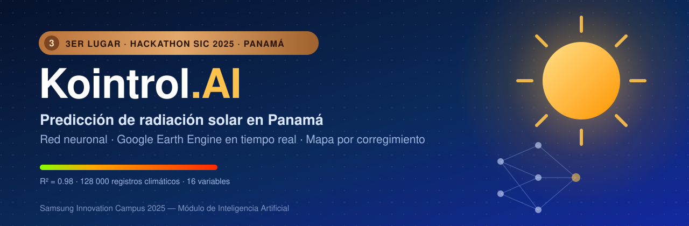
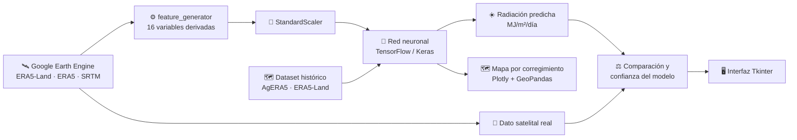
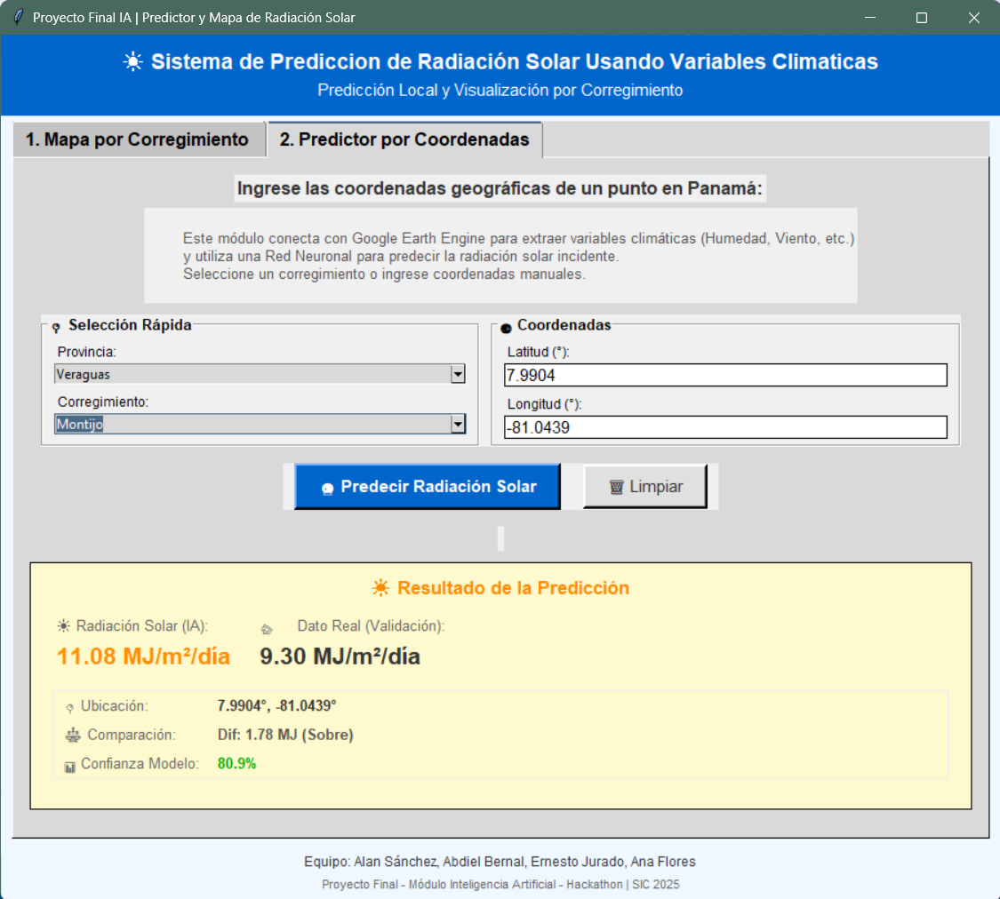
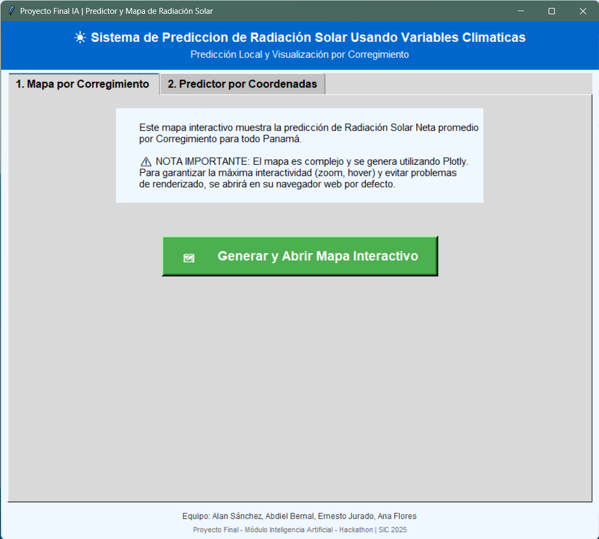
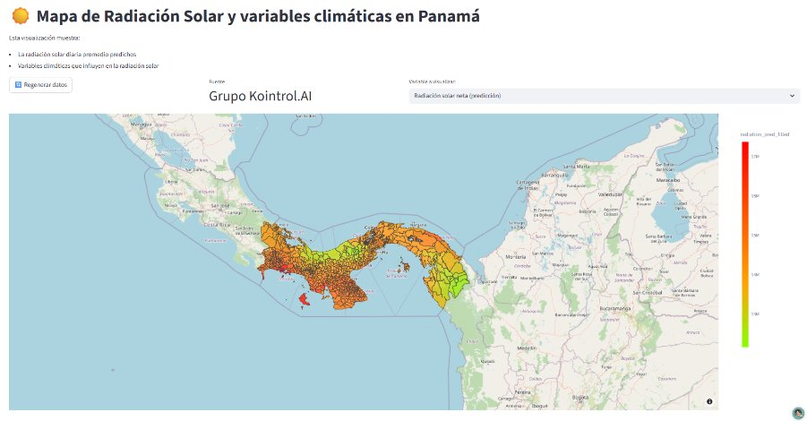

<div align="center">



<br/>


**Una aplicación de escritorio que usa inteligencia artificial y datos satelitales para estimar cuánta energía solar recibe cualquier punto de Panamá.**

[Problema](#-el-problema) · [Solución](#-la-solución) · [Demo](#-la-aplicación) · [Modelo](#-el-modelo) · [Instalación](#-instalación) · [Equipo](#-equipo)

</div>

---

## 🏆 Reconocimiento

Este proyecto obtuvo el **3er lugar en la Hackathon del Samsung Innovation Campus (SIC) 2025 — Panamá**, como parte del Proyecto Final del Módulo de Inteligencia Artificial.

Nació como proyecto final del curso y, durante la hackathon, el equipo lo llevó más allá: pasó de un predictor de demostración a un sistema que **se conecta en vivo con Google Earth Engine**, construye las variables del modelo en tiempo real y **valida cada predicción contra el dato satelital real**.

---

## 🌎 El problema

> **¿Cómo afecta el clima a la generación de los paneles solares?**

Panamá, por su ubicación tropical, recibe altos niveles de radiación solar, pero la nubosidad, la humedad y la lluvia hacen que esa radiación varíe mucho de un lugar a otro y de un día a otro. No existen herramientas accesibles para estimarla en un punto concreto del país, lo que dificulta planificar:

- ☀️ **Proyectos de energía solar** — dónde instalar y cuánto se puede generar.
- 🌾 **Agricultura** — riego, cultivos y planificación de temporadas.
- 🌿 **Gestión ambiental** — estudios climáticos y educación.

## 💡 La solución

**Kointrol.AI** combina una **red neuronal** entrenada con datos climáticos históricos con **datos satelitales en tiempo real**:

1. **Mapea todo el país** con variables climáticas por coordenada (128 000 registros).
2. **Predice la radiación solar neta** con un modelo de red neuronal densa (R² = 0.98).
3. **Visualiza los resultados por corregimiento** en un mapa interactivo.
4. **Predice en vivo para cualquier punto**: el usuario elige una provincia y un corregimiento (o escribe coordenadas), la app consulta Google Earth Engine, calcula las variables y muestra la predicción junto al valor real medido por satélite.



---

## 🖥️ La aplicación

<table>
  <tr>
    <td width="50%" align="center"><b>Predictor en tiempo real</b></td>
    <td width="50%" align="center"><b>Menú principal</b></td>
  </tr>
  <tr>
    <td></td>
    <td></td>
  </tr>
  <tr>
    <td>Selecciona provincia y corregimiento (o coordenadas). La app descarga el clima del satélite, predice la radiación y la compara con el valor real.</td>
    <td>Interfaz de escritorio organizada en pestañas: mapa nacional y predictor por punto.</td>
  </tr>
</table>

### Mapa de radiación solar por corregimiento


<p align="center"><i>Radiación solar neta diaria promedio predicha por la red neuronal para los corregimientos de Panamá (J/m²).</i></p>

<details>
<summary><b>🔍 Ver más: mapa web interactivo, y predicción frente a realidad</b></summary>
<br/>

**Mapa web interactivo**, con selector de variables climáticas:



| Predicción del modelo | Valor real (satélite) |
| :---: | :---: |
|  |  |

</details>

---

## 🧠 El modelo

Red neuronal densa construida con **TensorFlow/Keras**, entrenada con datos climáticos diarios de enero a junio de 2025 de todo Panamá.

<table>
<tr>
<td width="55%" valign="top">

| Bloque | Capas | Unidades |
| :--- | :--- | :---: |
| Entrada | `Dense` + `BatchNorm` | 128 |
| Bloque 1 | `Dense` + `BatchNorm` + `Dropout(0.1)` | 256 |
| Bloque 2 | `Dense` + `BatchNorm` | 256 |
| Bloque 3 | `Dense` + `BatchNorm` + `Dropout(0.05)` | 128 |
| Final | `Dense` | 64 → 32 |
| Salida | `Dense` (lineal) | 1 |

- **Activación:** GELU · **Regularización:** L2 (1e-6)
- **Optimizador:** Adam (lr = 3e-4) · **Pérdida:** MSE

| Métrica (validación) | Valor |
| :--- | :---: |
| **R²** | **0.9806** |
| MAE | ≈ 0.33 MJ/m²/día |
| RMSE | ≈ 0.48 MJ/m²/día |
| MAPE | 32.41 % |

</td>
<td width="45%" valign="top" align="center">

<br/><i>Real vs. predicción (J/m²)</i>
</td>
</tr>
</table>

### Variables del modelo (16 *features*)

| Grupo | Variables |
| :--- | :--- |
| 🌦️ **Clima** | Nubosidad media 24 h · Humedad relativa · Temperatura a 2 m (°C) · Precipitación total · Presión superficial |
| 🏔️ **Terreno** | Elevación (SRTM) |
| 📍 **Ubicación** | `sin`/`cos` de latitud y longitud |
| 📅 **Estacionalidad** | `sin`/`cos` del día del año · día del año normalizado |
| 🔁 **Memoria** | Radiación del día anterior (*lag 1*) |
| ➗ **Derivadas** | Índice temperatura-humedad · Relación nubosidad/presión |

**Variable objetivo:** `surface_net_solar_radiation_sum`, la radiación solar neta que llega a la superficie (J/m²).

### Fuentes de datos

| Fuente | Uso |
| :--- | :--- |
| **AgERA5** y **ERA5-Land** (Copernicus / ECMWF) | Dataset histórico de entrenamiento: 128 000 registros |
| **ERA5-Land Daily** y **ERA5 Hourly** vía Google Earth Engine | Consultas climáticas en tiempo real |
| **SRTM** (USGS) | Elevación del terreno |
| **Límites de corregimientos de Panamá** (GeoJSON) | Agregación y visualización por corregimiento |

---

## 📁 Estructura del proyecto

```
kointrol-ai-radiacion-solar-panama/
├── Hackaton_SIC_2025/              # 🏆 Versión de la hackathon (tiempo real)
│   ├── interfaz.py                 # Aplicación de escritorio (punto de entrada)
│   ├── Panama_Boundaries.geojson   # Provincias y corregimientos para los selectores
│   └── modulos_gee/
│       ├── modulos_gee.py          # Conexión y consultas a Google Earth Engine
│       └── feature_generator.py    # Ingeniería de características en vivo
│
├── Proyecto_final_SIC_2025/        # 📚 Proyecto final del módulo de IA
│   ├── Cleaning and Testing/       # Unión, limpieza y diagnóstico de datasets
│   ├── Datasets/                   # Datos climáticos, predicciones y límites geográficos
│   ├── Models/
│   │   ├── Trainings.ipynb         # Entrenamiento de la red neuronal
│   │   ├── predict.py              # Inferencia
│   │   ├── solar_model.keras       # Modelo entrenado
│   │   └── *.pkl                   # Escaladores y normalización del objetivo
│   ├── Visualization/              # Mapas, matriz de correlación y gráficas
│   └── solar_radiation_map_cache.html  # Mapa interactivo ya generado
│
├── docs/assets/                    # Banner y capturas para este README
└── requirements.txt
```

---

## 🚀 Instalación

### Requisitos previos

- **Python 3.10** o superior (Tkinter viene incluido en Python para Windows y macOS)
- Una **cuenta de servicio de Google Earth Engine** con su llave `.json`, solo para el predictor en tiempo real

### Pasos

```bash
# 1. Clonar el repositorio
git clone https://github.com/ejurado022-rgb/kointrol-ai-radiacion-solar-panama.git
cd kointrol-ai-radiacion-solar-panama

# 2. Crear y activar un entorno virtual
python -m venv venv
venv\Scripts\activate          # Windows
# source venv/bin/activate     # macOS / Linux

# 3. Instalar dependencias
pip install -r requirements.txt
```

### Configurar Google Earth Engine

El predictor en tiempo real necesita una cuenta de servicio de GEE. Indica la ruta de tu llave con variables de entorno:

```bash
# Windows (PowerShell)
$env:GEE_KEY_FILE = "C:\ruta\a\tu-llave.json"
$env:GEE_SERVICE_ACCOUNT = "tu-cuenta@tu-proyecto.iam.gserviceaccount.com"

# macOS / Linux
export GEE_KEY_FILE="/ruta/a/tu-llave.json"
export GEE_SERVICE_ACCOUNT="tu-cuenta@tu-proyecto.iam.gserviceaccount.com"
```

> [!WARNING]
> Nunca subas tu llave `.json` al repositorio. El `.gitignore` ya la excluye.

### Ejecutar

Desde la raíz del proyecto:

```bash
python Hackaton_SIC_2025/interfaz.py
```

> [!TIP]
> Para ver el mapa nacional sin configurar nada, abre `Proyecto_final_SIC_2025/solar_radiation_map_cache.html` en tu navegador.

---

## 👥 Equipo

**Equipo PA12 — Kointrol.AI** · Samsung Innovation Campus 2025, Panamá

| Integrante | Rol |
| :--- | :--- |
| **Alan Sánchez** · [@alanmuskk](https://github.com/alanmuskk) | Líder del proyecto. Modelo de red neuronal, arquitectura, interfaz y entrega final |
| **Abdiel Bernal** · [@PalInstagram](https://github.com/PalInstagram) | Visualización de datos: mapas con GeoPandas y Plotly, límites geográficos |
| **Ernesto Jurado** · [@ejurado022-rgb](https://github.com/ejurado022-rgb) | Base de la interfaz de usuario en Tkinter y continuidad del diseño |
| **Ana Flores** · [@anappp15](https://github.com/anappp15) | Datos climáticos, conexión con la API de Google Earth Engine y modularización |

---

## 🙏 Agradecimientos

A **Samsung Innovation Campus**, por la formación en Python e Inteligencia Artificial que hizo posible este proyecto y por organizar la Hackathon SIC 2025, donde obtuvimos el **3er lugar**.

A los **docentes y tutores del programa SIC 2025 en Panamá**, por su acompañamiento durante el desarrollo.

Este repositorio conserva el historial completo del [repositorio oficial del programa](https://github.com/fundestddelgado/PA12-KOINTROL.IA-PROYECTO-FINAL), donde se desarrolló originalmente, con los commits de cada integrante.

---

<div align="center">

<sub>Proyecto académico desarrollado en el marco de <b>Samsung Innovation Campus 2025</b>. Samsung y Samsung Innovation Campus son marcas de sus respectivos titulares. Este repositorio no es un producto oficial de Samsung.<br/>
La aplicación es una herramienta de apoyo; para decisiones críticas (inversiones energéticas, planificación agrícola) complementa sus resultados con asesoría profesional.</sub>

<br/><br/>

**☀️ Hecho en Panamá con datos, satélites y redes neuronales.**

</div>
